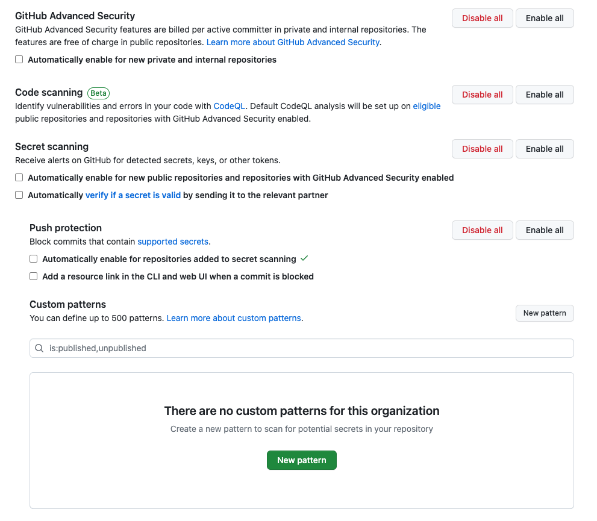
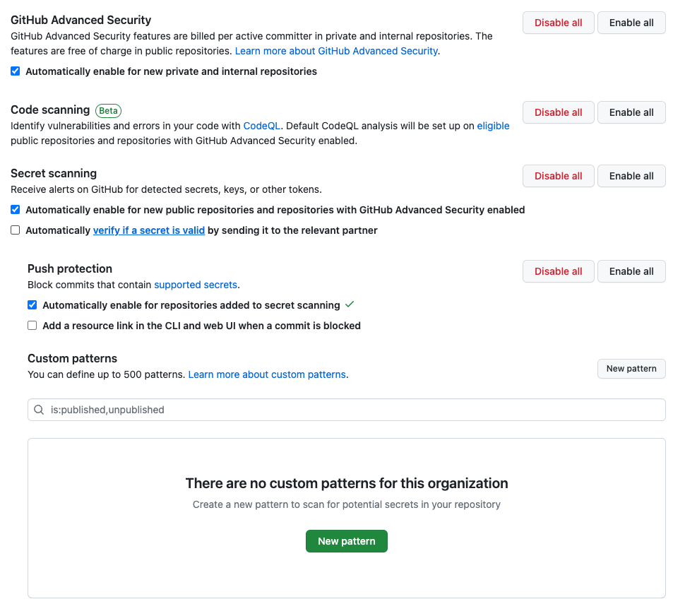

# GHAS Org Enablement

This tool manages GitHub Advanced Security enablement for new repositories at the organization level.

Provide the organization flag to filter and run for a single organization or omit it to run for all orgs in an enterprise.

Provide the url flag to run against GitHub Enterprise Server or omit it to run against GitHub.com.

## Usage

Run the tool via command line:

```
$ ./ghas-org-enablement --help
```

### activate-ghas-features

```
$ ./ghas-org-enablement activate-ghas-features --enterprise <enterprise> --token <token> --organization <organization> --url <url>
```

### deactivate-ghas-features

```
$ ./ghas-org-enablement deactivate-ghas-features --enterprise <enterprise> --token <token> --organization <organization> --url <url>
```

## Results

The tool will change the following organization settings, under "Code security and analysis":

### Before activation



### After activation



## Token scopes

the PAT token needs following scopes:

`admin:org`, `read:enterprise`

The former allows changing organization settings and the latter is used to list all organizations in the enterprise.
